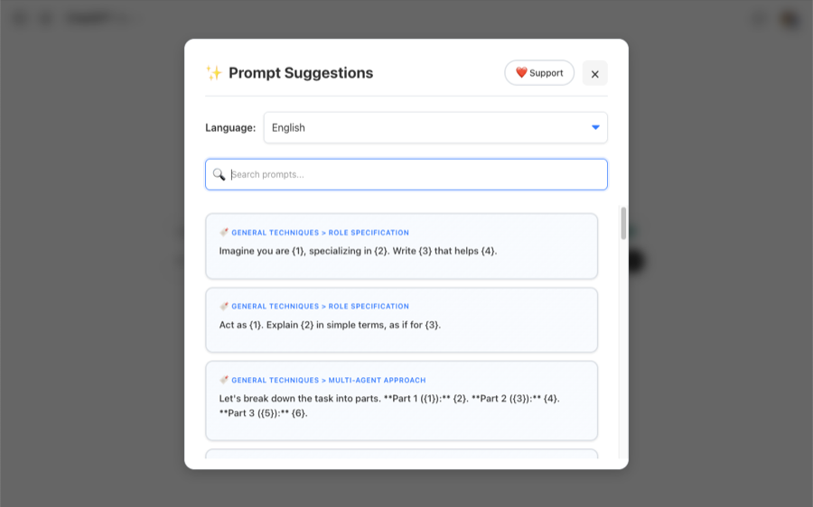

# AI Prompt Suggester

A browser extension that adds a prompt library to the chat box of ChatGPT, Claude, Gemini, Perplexity, Grok, Mistral, DeepSeek, Copilot, Qwen and LM Arena. Click the lightbulb, pick a prompt, fill in the blanks, and it lands in the chat input.

Install: [Chrome Web Store](https://chromewebstore.google.com/detail/ai-prompt-suggester/ffacabgddhepblahneohlpgmepogoohl) | [Firefox Add-ons](https://addons.mozilla.org/en-US/firefox/addon/ai-prompt-suggester/) | [Product page](https://mrwd.github.io/products/ai-prompt-suggester/)

## Why

Most people type the same vague requests into every chat. The library ships a set of prompt-engineering techniques (role specification, few-shot, chain of thought and so on), each with a template, a filled-in example and a short explanation of why it works. The idea is to learn better prompting while you use it, not to read a guide first.

## Features

- Prompt library in 7 languages: English, German, Russian, Italian, French, Spanish, Chinese
- Search as you type, with matches highlighted in prompt text and categories
- Inline inputs: `{1}`, `{2}` placeholders in a prompt become input fields right in the text, with a live preview of the final prompt
- Full keyboard control: arrow keys to move between prompts and inputs, `Enter` to apply, `Ctrl+C` / `Cmd+C` to copy, `Escape` to close
- Follows the system light/dark theme
- No build step, no background script, no storage. Vanilla JS and CSS, loaded straight from the repo

## Supported sites

- ChatGPT (chat.openai.com, chatgpt.com)
- Google Gemini (gemini.google.com)
- Claude (claude.ai)
- Perplexity (www.perplexity.ai)
- Grok (grok.com)
- Mistral Le Chat (chat.mistral.ai)
- DeepSeek (chat.deepseek.com)
- Microsoft Copilot (copilot.microsoft.com)
- Qwen (chat.qwen.ai)
- LM Arena (lmarena.ai, chat.lmsys.org)

Each site is a small adapter in `src/js/utils/platforms/` that knows where the chat input is and where to put the button. Chat UIs change often, so if the button stops showing up on a site, that adapter is the place to look.

## Supported browsers

- Chrome, Edge, Opera and other Chromium browsers (version 88+)
- Firefox (version 109+)

## Installation

The store links above are the easy way. To run it from source:

### Chrome, Edge, Opera
1. Clone this repository or download the ZIP file
2. Open `chrome://extensions/`
3. Enable "Developer mode" in the top right
4. Click "Load unpacked" and select the extension directory

### Firefox
1. Clone this repository or download the ZIP file
2. Open `about:debugging#/runtime/this-firefox`
3. Click "Load Temporary Add-on"
4. Select `manifest.json` from the extension directory

## Usage

1. Open any supported chat site
2. Click the lightbulb button next to the chat input
3. Search for a prompt (the search box is focused when the modal opens)
4. Move with `↑` / `↓` or click a prompt to select it
5. Fill in the inline inputs, if the prompt has any
6. Press `Enter` or click "Apply to Chat"

### Keyboard shortcuts
- `Ctrl+F` / `Cmd+F` - focus the search box
- `↑` / `↓` - move between search results, or between input fields
- `←` / `→` - move between input fields when the cursor is at the start or end of an input
- `Enter` - select a prompt (shows its inputs if it has any, otherwise applies it)
- `Ctrl+C` / `Cmd+C` - copy the current prompt text with the values filled in
- `Escape` - close the modal or clear the current selection

Tip: select a prompt and press `Ctrl+C` to copy it for use somewhere else without applying it to the chat.

## How it works

- `manifest.json` - Manifest V3, `activeTab` plus explicit host permissions per site, nothing else
- `src/js/content.js` - entry point; creates the modal and watches the page with a `MutationObserver` so the button reappears after the chat UI re-renders
- `src/js/utils/PlatformUtils.js` - picks the platform adapter by URL
- `src/js/utils/platforms/*.js` - one class per site with `getInputElement`, `getTargetElement` and `getObserverConfig`
- `src/js/components/Modal.js` - the library UI: search, highlighting, inline inputs, keyboard navigation, copy with a clipboard fallback
- `src/js/components/SuggestionButton.js` - the lightbulb button
- `src/js/services/PromptService.js` - loads `prompts/<lang>.json` for the chosen language
- `src/js/utils/ChatInputUtils.js` - writes the final text into the chat input (textarea or contenteditable)
- `prompts/*.json` - the catalogs; each entry has a category, template, example and explanation
- `popup.html` / `popup.js` - the toolbar popup

Current version is 1.0.1 (see `manifest.json`).

## Contributing

Pull requests are welcome. Adding a site means adding one adapter class in `src/js/utils/platforms/`, wiring it in `PlatformUtils.js` and listing the host in `manifest.json`. Adding a language means a new `prompts/<lang>.json` with the same structure as `en.json`. Please test keyboard navigation, search and copy on the site you touch.

If the extension is useful to you, a star helps, and there is a [Buy Me a Coffee](https://buymeacoffee.com/ipupok) page.

## License

MIT, see [LICENSE](LICENSE).
